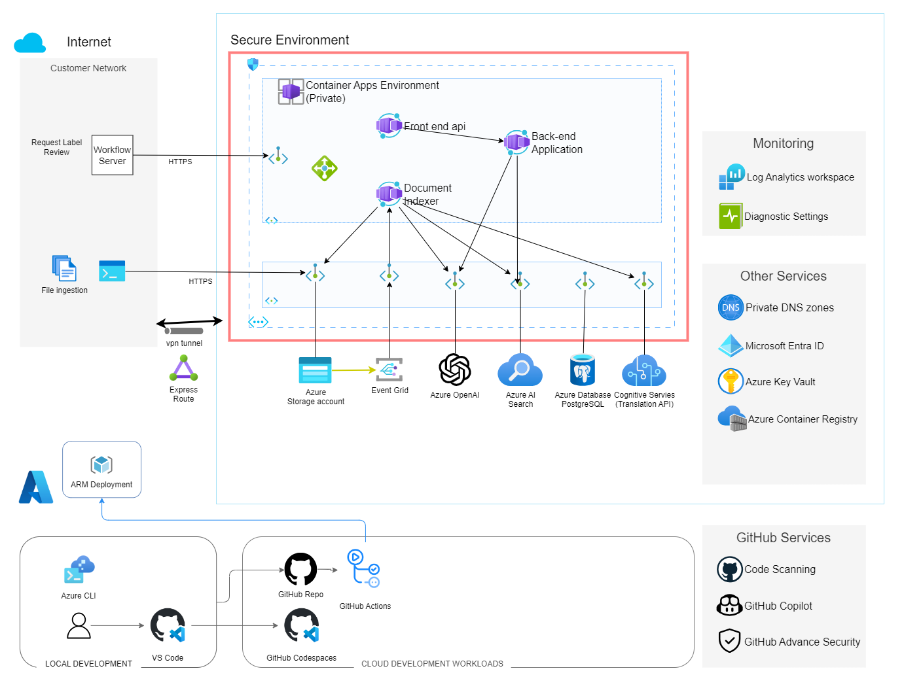
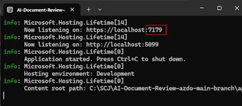
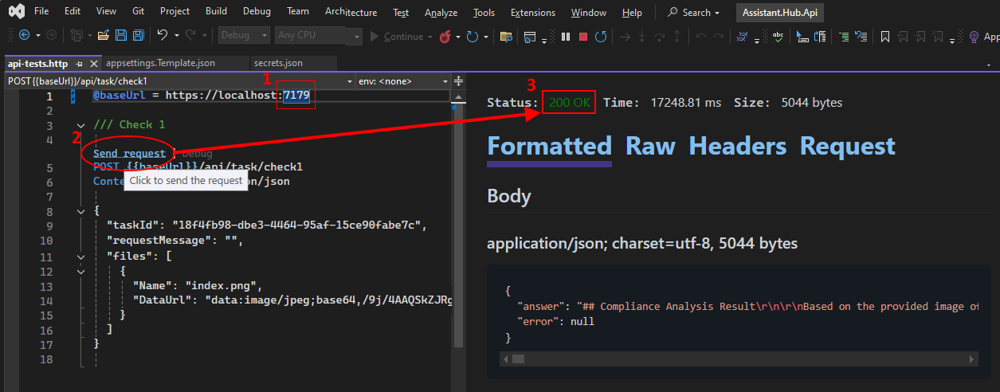

# AI Document Review

This project is a demonstration of how to use Azure OpenAI to analyze and validate documents for compliance with guidelines, providing automated feedback reports for actionable insights and remediation.

## Architecture and Overview

The solution uses Azure Container Apps to deploy and run the application, consisting of an API and a very simple UI. In the UI, the user can supply a document or image to review, and it will call the API and use OpenAI tools to analyze the document and provide feedback. The prompts and processes are easily configurable and can be modified to suit your needs.



---

## Getting Started

This project uses Infrastructure as Code (IaC) to deploy and manage the Azure resources, utilizing [Bicep](https://learn.microsoft.com/en-us/azure/azure-resource-manager/bicep/overview) to deploy Azure resources declaratively.

Automated workflows are included in the project for both [GitHub Actions](./.github/github_setup.md) and [Azure DevOps Pipelines](./.azdo/pipelines/readme.md) to deploy the resources. The workflows are designed to be multi-environment, allowing you to deploy to different environments (DEV/QA/PROD) with different configurations, secrets, permissions and approvals.

In this initial demo, any change to the code will deploy automatically to DEV. Deploying to the QA and PROD environments will require a manual deployment. You will want to modify the workflows to suit your team's work standards.

In either case, to begin using this demo, you will need to:

1. Fork this repository (or import it into your own environment)
1. Create a service principal with rights to deploy resources
1. Configure some environment variables
1. Deploy the initial Azure resources
1. Start modifying the code to meet your requirements

Get started by choosing one of the following setup guides:

- [GitHub Actions Setup](./.github/setup.md)
- [Azure DevOps Setup](./.azdo/pipelines/readme.md)

---

## Development

You will want to set up a local development environment if you want to develop a new feature or fix issues.
See the [developers](./docs/developers.md) page for more information on setting up Dev Containers (if desired).

## Running the Application

To run the base API application, open the [app/Assistant.Hub.Api/Assistant.Hub.Api.sln](./app/Assistant.Hub.Api/) in Visual Studio (or VS Code). Set up the following keys in the user secrets by right-clicking on the Project and selecting `Manage User Secrets`.

> Alternatively, you can add these values into the [appsettings.json](./app/Assistant.Hub.Api/appsettings.json) or appsettings.development.json file, just be sure not to check those values into source control!

Find your URL and key and deployment name for your OpenAI instance, and then add these required keys to your secrets. If you are NOT using Managed Identities, the AOAIStandardServiceKey key is required: (but you should be using them so this should be optional)

```bash
"AOAIStandardServiceEndpoint": "https://<YOUR-INSTANCE>.openai.azure.com/",
"AOAIStandardChatGptDeployment": "gpt-4o"
"AOAIStandardServiceKey": "<yourKey-optional>",
```

Find these additional resource endpoints and keys and propagate them into your secrets file:

```bash
"AzureDocumentIntelligenceEndpoint": "https://<YOUR-INSTANCE>.cognitiveservices.azure.com/",
"AzureDocumentIntelligenceKey": "<VALUE>",

"AzureAISearchEndpoint": "https://<YOUR-INSTANCE>.search.windows.net",
"AzureAISearchKey": "<VALUE>",

"StorageAccountName": "<STORAGE_ACCOUNT_NAME>",
"ContentStorageContainer": "<STORAGE_CONTAINER_NAME>",
```

Now that the secrets are provisioned, run the API application and you should see it run on port 7179 (or some similar port).



Switch back to Visual Studio and open the [api-tests-prompt-in-embedded-file.http](app/Assistant.Hub.Api/api-tests-prompt-in-embedded-file.http) file. Update the port in the `@baseURL` variable, then click on the `Send Request` link, and you can run the tests to ensure the API is working correctly.



> Note: this documentation shows examples using Visual Studio Code, but you can also run each of these steps in VS or in VS Code, including managing user secrets in VS Code using [this extension](https://marketplace.visualstudio.com/items?itemName=adrianwilczynski.user-secrets) and the executing the http test client.

---

## Git Development Tips

Read the [Git tips](./docs/git_tips.md) document for some helpful tips on how to use best Git.

Read the [Pull Request Guidelines](./docs/pr_standards.md) document for some helpful tips on how to use utilize Pull Requests.

---

## References

- [Private Networking in Azure Container Apps environment](https://learn.microsoft.com/en-us/azure/container-apps/networking)
- [OpenAI: Questions and Answers using embeddings](https://cookbook.openai.com/examples/question_answering_using_embeddings)

---

[Home Page](../README.md)
