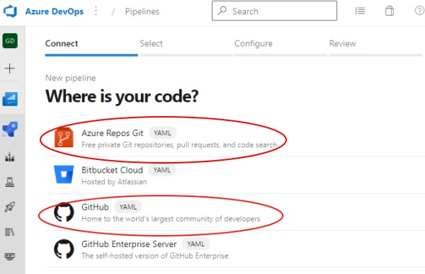
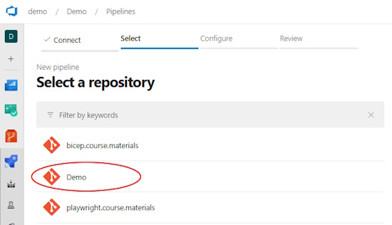
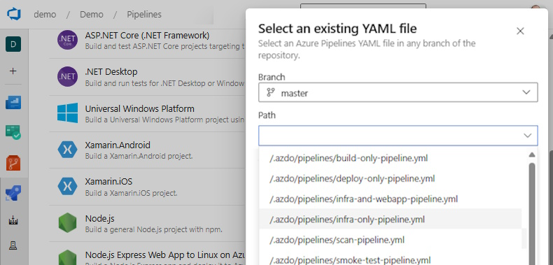
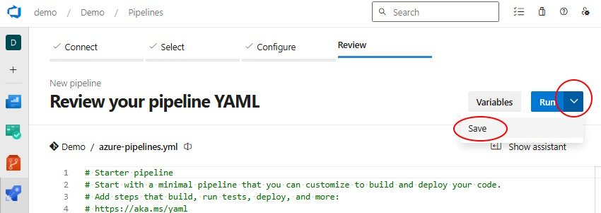
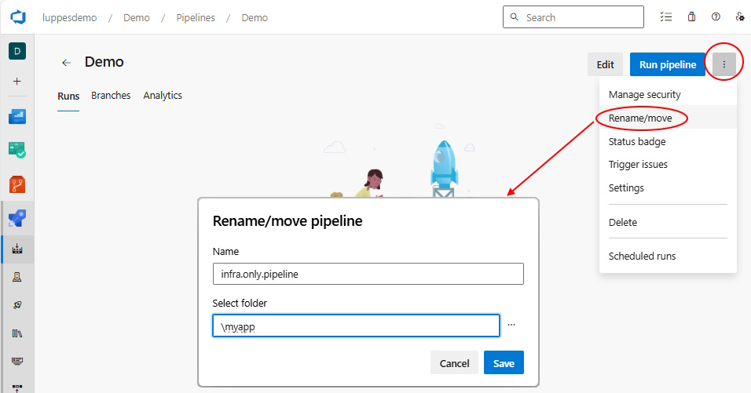

# Create Azure DevOps Pipelines

To create an Azure DevOps pipeline from an existing YML file in a GitHub repository, follow these steps.

---

**Step 1:** Click New pipeline from the Pipeline section of the Azure DevOps project

**Step 2:** Select source as Azure Repos Git (or GitHub):

**Step 3:** Select the repository

**Step 4:** Select Existing Pipelines YAML file

**Step 5:** Select the desired pipeline

**Step 6:** For most cases, when the pipeline source is shown, you can just click Run and start your pipeline. However, if you need to adjust some settings, then select More Actions and Save the file.

**Step 7:** Rename your pipeline: by default, the name of the new pipeline will default to the name of the repository, which is not very informative if you have more than one pipeline. Click on the `More` icon, then rename and give this pipeline a name that more closely matches the name of the file.

**Step 8:** You should be ready to run your new pipeline!

---

[Return to main README](../.azdo/pipelines/README.md)
